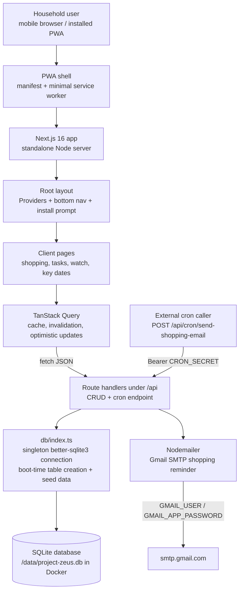
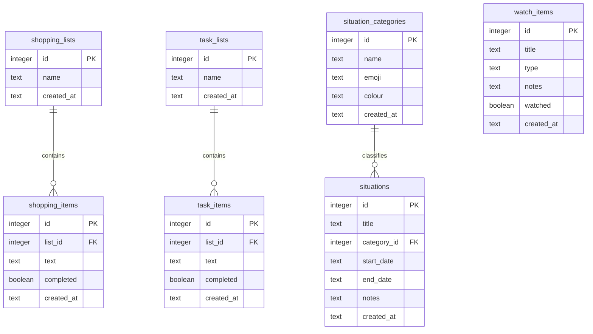
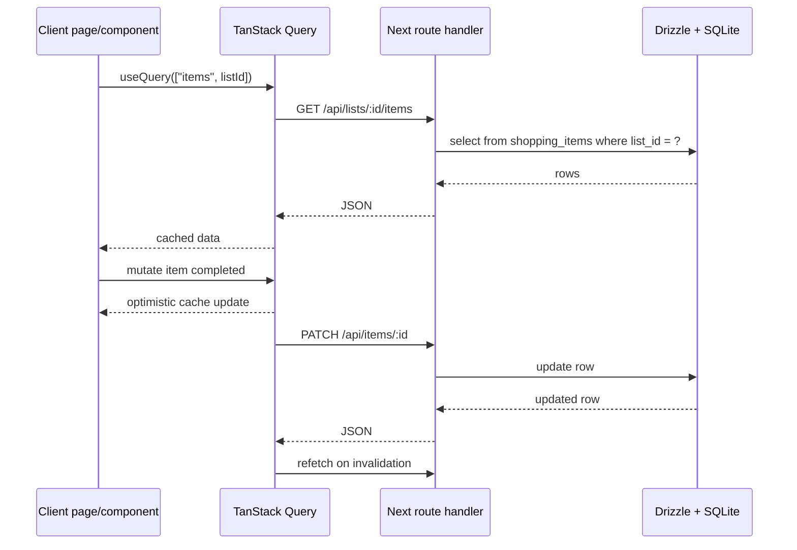

# Project Zeus Architecture

Project Zeus is a self-hosted, mobile-first household coordination app. It is built as a Next.js 16 App Router application with client-heavy pages, API route handlers, Drizzle ORM, and a single local SQLite database. The intended production shape is one Docker container running on a Raspberry Pi with SQLite data persisted in a Docker volume.

## System Diagram

## Runtime Shape

The app uses the App Router file-system model: `app/layout.tsx` wraps every route with `QueryClientProvider`, the fixed bottom navigation, and the PWA install prompt. `app/page.tsx` redirects to `/shopping`.

Most user-facing routes are `"use client"` pages. They call internal API routes with `fetch`, manage local UI state, and rely on TanStack Query for loading state, client caching, optimistic mutation updates, and post-mutation invalidation. There is currently no server-side data preloading or route-level authorization.

Route handlers under `app/api/**/route.ts` are the server boundary. They parse route params and request JSON, call `getDb()`, run Drizzle queries, and return JSON responses. The API is organized around independent resource families rather than a shared service layer.

The database layer is intentionally small. `db/schema.ts` defines Drizzle table objects and inferred TypeScript types. `db/index.ts` opens a process-wide singleton `better-sqlite3` connection, enables WAL and foreign keys, creates tables if missing, and seeds default shopping lists and situation categories.

Production deployment is a standalone Next build in Docker. `docker-compose.yml` mounts the named `zeus-data` volume to `/data`, and the container sets `DATABASE_PATH=/data/project-zeus.db`.

## Main Modules

| Area | Routes / files | Current responsibility |
|---|---|---|
| Shopping | `/shopping`, `/shopping/[id]`, `/api/lists`, `/api/items` | Shopping list CRUD, item add/toggle/delete, optimistic updates. |
| Tasks | `/tasks`, `/tasks/[id]`, `/api/task-lists`, `/api/task-items` | Task-list CRUD using a near-copy of the shopping list pattern. |
| Key Dates | `/key-dates`, `/api/situations`, `/api/situation-categories` | Date-based “situations”, categories, grouping by today/tomorrow/week/month. |
| Watch List | `/watch`, `/api/watch-items` | Film/series/documentary watch queue with filtering and watched state. |
| PWA | `public/manifest.json`, `public/sw.js`, `components/InstallPrompt.tsx` | Installability prompt and standalone mobile experience; no offline cache. |
| Email Cron | `/api/cron/send-shopping-email`, `lib/mailer.ts` | Authenticated cron endpoint that emails incomplete shopping items through Gmail SMTP. |

## Data Model

The schema is simple and well suited to a single-household SQLite app. Two important implementation details are worth noting:

- `shopping_*` and `task_*` are structurally identical but implemented separately, causing duplicate UI, API, and mutation logic.
- Schema creation happens imperatively in `db/index.ts`, while Drizzle Kit is configured separately. There is no migration history in the repository.

## Request Flow

## Strengths

- The deployment model is straightforward: one Next server, one SQLite file, one Docker volume.
- The data model is easy to reason about and matches the household-scale product.
- TanStack Query is used consistently for optimistic UX in list/item workflows.
- The route-handler boundary is clear: client components never import or call the database directly.
- The PWA shell is pragmatic for mobile home-screen use without overcommitting to offline behavior.

## Recommended Changes

### Highest Priority

1. Add real migrations and remove boot-time DDL as the source of truth. Use Drizzle Kit migrations for schema evolution, keep seed logic explicit, and run migrations during startup/deploy. This reduces the risk of silent schema drift as tables change.
2. Introduce shared validation for every API input. Current handlers trust JSON shape beyond basic trimming, and several updates accept arbitrary booleans or enum values. A small schema layer would protect the database and simplify error handling.
3. Add authentication or network-level access controls for non-cron API routes. The app may be intended for a local network, but every CRUD endpoint is currently open to anyone who can reach the server.
4. Fix environment variable drift. Runtime uses `DATABASE_PATH`, Drizzle config uses `DB_PATH`, and the README still documents `DB_PATH`; standardize on one name and update docs/scripts.
5. Fix the current lint failure in `components/InstallPrompt.tsx`. The React hooks lint rule flags synchronous `setState` inside an effect, so the repository does not currently pass `npm run lint`.
6. Add automated coverage for route handlers and date grouping. The app has no test script, and the highest-risk logic is API validation, optimistic mutation assumptions, and date grouping around local time.

### Code Quality And Extensibility

1. Extract a reusable list module for shopping and tasks. The pages, API route handlers, cards, item components, and optimistic mutations are near-duplicates; shared factories/hooks/components would reduce defects and make new list-like modules cheaper.
2. Move database operations into domain repositories or services. Route handlers currently contain persistence details directly, which is fine at this size but will become brittle as features add validation, filtering, audit, or richer errors.
3. Centralize query keys and API client functions. String query keys and raw `fetch` calls are repeated across components, making cache invalidation and error behavior easy to accidentally diverge.
4. Add consistent API response handling on the client. Many mutation functions call `res.json()` or ignore `res.ok`, so server errors can appear as successful mutations until an invalidation refetch.
5. Define module metadata once. Navigation, active/coming-soon status, route labels, and module pages are currently separate concerns; a small module registry would make adding/removing features safer.

### Security

1. Escape or safely render email HTML content. `lib/mailer.ts` interpolates shopping item text and list names into HTML. React safely escapes browser UI, but the email builder does not.
2. Validate cron configuration and document secret rotation. `CRON_SECRET` protects only the email cron endpoint; it should be high entropy, not checked into environment examples as a real-looking value, and rotated if exposed.
3. Add request size limits or defensive parsing. `await req.json()` is used directly across handlers; large or malformed payloads should fail predictably.
4. Consider CSRF posture if the app is exposed beyond a trusted LAN. Cookie auth is not present today, but if added later, mutation endpoints need CSRF protection.

### Operations

1. Add backup and restore scripts for the SQLite volume. README documents a manual backup command, but repeatable scripts would reduce operational mistakes on the Pi.
2. Add health/readiness checks. A simple endpoint that opens the database and returns status would make Docker and cron diagnostics easier.
3. Add structured logging around cron and mutation failures. Current handlers mostly return JSON but do not log enough context for production diagnosis.
4. Document data retention and recovery expectations. SQLite is appropriate here, but the project should state how often data is backed up and how restores are tested.

### UX And Product

1. Make destructive actions discoverable beyond long press. Long press is efficient but hidden; consider visible delete affordances in edit mode or swipe actions.
2. Improve empty/error/loading states for API failures. Most pages distinguish loading and empty, but not failed network/server states.
3. Decide whether the PWA should be offline-capable. The service worker intentionally does no caching. That is valid, but if shopping is used in stores with poor reception, offline reads and queued writes may become important.

## Architectural Direction

The current architecture is appropriate for a small, single-household, self-hosted app. The next architectural step should not be a large rewrite; it should be to harden boundaries:

- Keep Next route handlers as the HTTP boundary.
- Add domain-level repositories/services under `lib/server` or `server`.
- Add shared validation schemas used by both API handlers and forms.
- Make Drizzle migrations the only schema-change mechanism.
- Extract reusable list primitives before adding more modules.

That path preserves the simplicity that makes the app deployable on a Raspberry Pi while reducing the risks that come from duplication, unauthenticated mutation endpoints, and implicit schema management.
